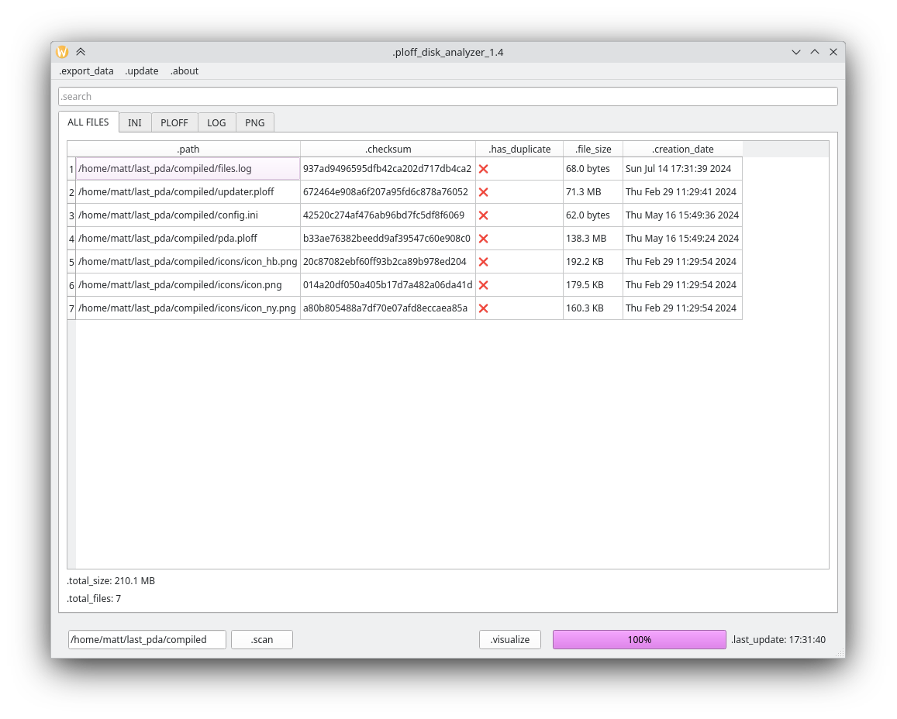
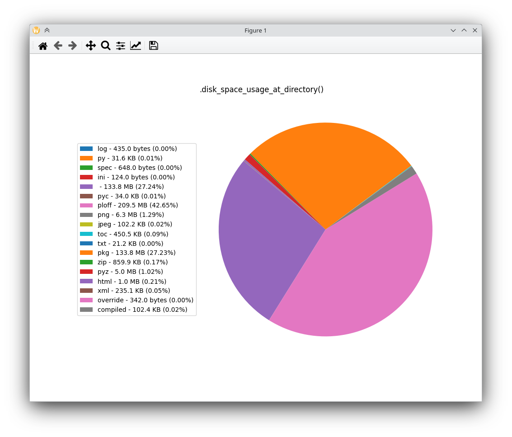

# ploff disk analyzer

disk analyzer on python.

shows files in scan directory, their size, creation date, calculates checksum and shows duplicates.

also have watchdog for logging actions in directory and shows via pie chart extension statistics.
